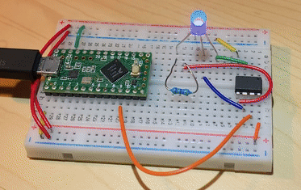

# ATtiny85 Test Code

The current file takes one pwm signal and outputs a constant pwm signal from one of three output pins depending on the reveived pwm signal.

This is a GIF of the test circuit:

The green microcontroller (Teensy LC) sends a pwm signal at one of three microsecond values, switching values every second. The ATTiny85 receives the signal at Pin 2 (long orange wire) and outputs a pwm signal from one of the output pins (marked by the red, green, and blue wires). This turns on one of the colored LEDs in the tri-color LED.
